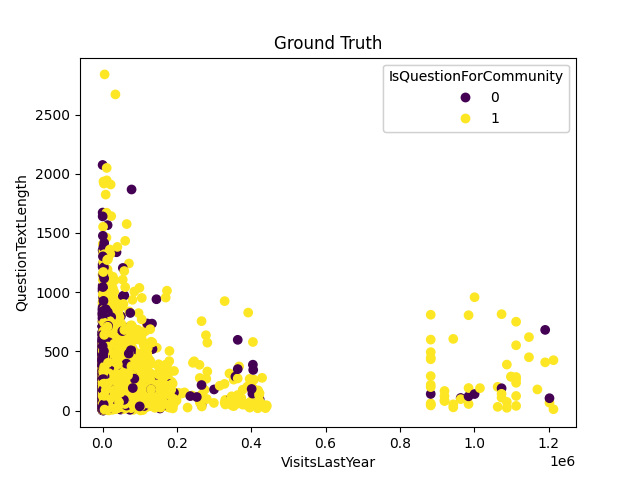
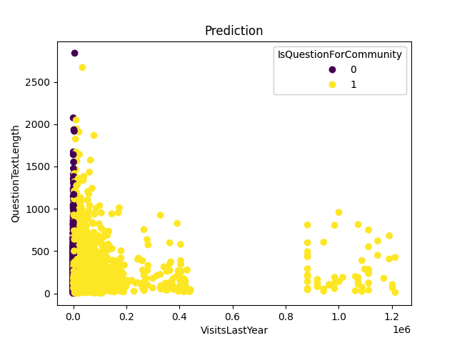

# Visualization
 
# How to Run
## 0. Virtual Environment
[Create a virtual environment](https://packaging.python.org/guides/installing-using-pip-and-virtual-environments/#creating-a-virtual-environment) using Python Version 3.8 and run

```
pip install -r requirements.txt
```

## 1. Prepare data

Move the juniorMLE_dataset.csv file into the folder `./data`.

## 2. Train your model

To train your own model, execute

```
python train.py
```

This generates a final_model.pt in the current directory.

## 3. Create a Docker Image

Make sure to have Docker [installed](https://docs.docker.com/engine/install/ubuntu/) and then run

```
docker build -t digitec .
```

to build your docker image.

## 3. Run a Docker Container

Run a Docker container with

```
docker run -p 5000:5000 -it digitec
```

This creates a Flask API on [localhost:5000](http://localhost:5000).

## 4. Get your predictions
* You can either make requests via the browser using the GET fields
on [localhost:5000/api/prediction?visits=1300&&text_length=300](http://localhost:5000/api/prediction?visits=1300&&text_length=300)
* Or via curl using the command
```
curl http://localhost:5000/api/prediction?visits=1300&&text_length=300
```
